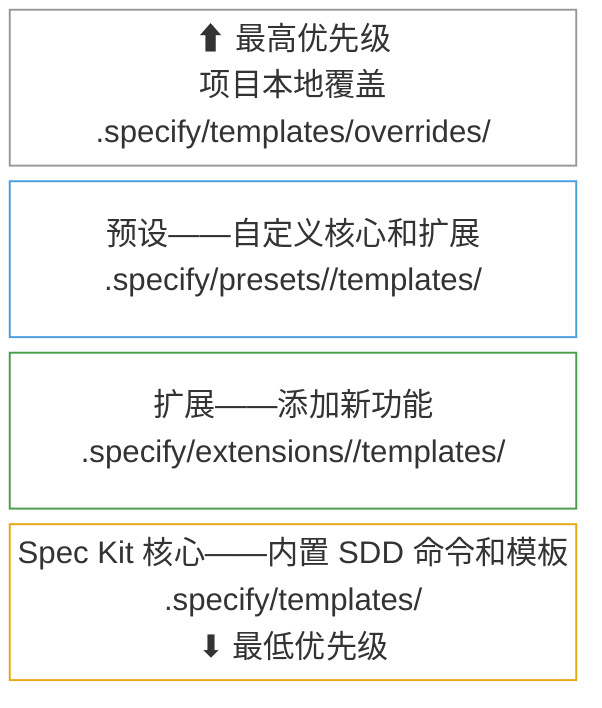

<div align="center">
    
    <h1>🌱 Spec Kit</h1>
    <h3><em>更快地构建高质量软件。</em></h3>
</div>

<p align="center">
    <strong>一个开源工具包，让你专注于产品场景和可预测的结果，而不是从零开始即兴编写每一段代码。</strong>
</p>

<p align="center">
    <a href="https://github.com/github/spec-kit/releases/latest"></a>
    <a href="https://github.com/github/spec-kit/stargazers"></a>
    <a href="https://github.com/github/spec-kit/blob/main/LICENSE"></a>
    <a href="https://github.github.io/spec-kit/"></a>
</p>

---

## 目录

- [🤔 什么是规格驱动开发？](#-什么是规格驱动开发)
- [⚡ 快速开始](#-快速开始)
- [📽️ 视频概览](#️-视频概览)
- [🧩 社区扩展](#-社区扩展)
- [🎨 社区预设](#-社区预设)
- [🚶 社区演练](#-社区演练)
- [🛠️ 社区伙伴](#️-社区伙伴)
- [🤖 支持的 AI 代理](#-支持的-ai-代理)
- [🔧 Specify CLI 参考](#-specify-cli-参考)
- [🧩 定制你的 Spec Kit：扩展与预设](#-定制你的-spec-kit扩展与预设)
- [📚 核心哲学](#-核心哲学)
- [🌟 开发阶段](#-开发阶段)
- [🎯 实验目标](#-实验目标)
- [🔧 前置条件](#-前置条件)
- [📖 了解更多](#-了解更多)
- [📋 详细流程](#-详细流程)
- [🔍 故障排除](#-故障排除)
- [💬 支持](#-支持)
- [🙏 致谢](#-致谢)
- [📄 许可证](#-许可证)

## 🤔 什么是规格驱动开发？

规格驱动开发**颠覆了传统软件开发**。几十年来，代码一直是王道——规格说明只是我们在"真正的工作"（编码）开始后就丢弃的脚手架。规格驱动开发改变了这一点：**规格说明变成了可执行的**，直接生成工作实现，而不仅仅是指导它们。

## ⚡ 快速开始

### 1. 安装 Specify CLI

选择你喜欢的安装方法：

#### 选项 1：持久安装（推荐）

安装一次，随处使用。固定特定的发布标签以保证稳定性（检查 [Releases](https://github.com/github/spec-kit/releases) 获取最新版本）：

```bash
# 安装特定的稳定版本（推荐——将 vX.Y.Z 替换为最新标签）
uv tool install specify-cli --from git+https://github.com/github/spec-kit.git@vX.Y.Z

# 或从 main 安装最新版本（可能包含未发布的更改）
uv tool install specify-cli --from git+https://github.com/github/spec-kit.git
```

然后直接使用该工具：

```bash
# 创建新项目
specify init <PROJECT_NAME>

# 或在现有项目中初始化
specify init . --ai claude
# 或
specify init --here --ai claude

# 检查已安装的工具
specify check
```

要升级 Specify，请参阅[升级指南](./docs/upgrade.md)了解详细说明。快速升级：

```bash
uv tool install specify-cli --force --from git+https://github.com/github/spec-kit.git@vX.Y.Z
```

#### 选项 2：一次性使用

直接运行而无需安装：

```bash
# 创建新项目（固定到稳定版本——将 vX.Y.Z 替换为最新标签）
uvx --from git+https://github.com/github/spec-kit.git@vX.Y.Z specify init <PROJECT_NAME>

# 或在现有项目中初始化
uvx --from git+https://github.com/github/spec-kit.git@vX.Y.Z specify init . --ai claude
# 或
uvx --from git+https://github.com/github/spec-kit.git@vX.Y.Z specify init --here --ai claude
```

**持久安装的优势：**

- 工具保持安装并在 PATH 中可用
- 无需创建 shell 别名
- 使用 `uv tool list`、`uv tool upgrade`、`uv tool uninstall` 更好地管理工具
- 更清洁的 shell 配置

#### 选项 3：企业/离线安装

如果你的环境阻止访问 PyPI 或 GitHub，请参阅[企业/离线安装](./docs/installation.md#enterprise--air-gapped-installation)指南，了解使用 `pip download` 在联网机器上创建可移植的、特定于操作系统的 wheel 包的分步说明。

### 2. 建立项目原则

在项目目录中启动你的 AI 助手。大多数代理将 spec-kit 以 `/speckit.*` 斜杠命令的形式公开；Codex CLI 在技能模式下使用 `$speckit-*` 代替。

使用 **`/speckit.constitution`** 命令创建你的项目的治理原则和开发指南，这些原则将指导所有后续开发。

```bash
/speckit.constitution Create principles focused on code quality, testing standards, user experience consistency, and performance requirements
```

### 3. 创建规格说明

使用 **`/speckit.specify`** 命令描述你想要构建什么。专注于**什么**和**为什么**，而不是技术栈。

```bash
/speckit.specify Build an application that can help me organize my photos in separate photo albums. Albums are grouped by date and can be re-organized by dragging and dropping on the main page. Albums are never in other nested albums. Within each album, photos are previewed in a tile-like interface.
```

### 4. 创建技术实现计划

使用 **`/speckit.plan`** 命令提供你的技术栈和架构选择。

```bash
/speckit.plan The application uses Vite with minimal number of libraries. Use vanilla HTML, CSS, and JavaScript as much as possible. Images are not uploaded anywhere and metadata is stored in a local SQLite database.
```

### 5. 分解为任务

使用 **`/speckit.tasks`** 从你的实现计划创建可操作的任务列表。

```bash
/speckit.tasks
```

### 6. 执行实现

使用 **`/speckit.implement`** 执行所有任务并根据计划构建你的功能。

```bash
/speckit.implement
```

有关详细的分步说明，请参阅我们的[综合指南](./spec-driven.md)。

## 📽️ 视频概览

想看 Spec Kit 的实际应用？观看我们的[视频概览](https://www.youtube.com/watch?v=a9eR1xsfvHg&pp=0gcJCckJAYcqIYzv)！

[](https://www.youtube.com/watch?v=a9eR1xsfvHg&pp=0gcJCckJAYcqIYzv)

## 🧩 社区扩展

> [!NOTE]
> 社区扩展由各自的作者独立创建和维护。GitHub 和 Spec Kit 维护者可能会审查添加社区目录条目的拉取请求的格式、目录结构或策略合规性，但他们**不审查、审计、认可或支持扩展代码本身**。社区扩展网站也是第三方资源。安装前请审查扩展源代码，自行决定使用。

🔍 **在[社区扩展网站](https://speckit-community.github.io/extensions/)上浏览和搜索社区扩展。**

以下社区贡献的扩展可在 [`catalog.community.json`](extensions/catalog.community.json) 中获取：

**分类：**

- `docs` — 读取、验证或生成规格工件
- `code` — 审查、验证或修改源代码
- `process` — 跨阶段编排工作流
- `integration` — 与外部平台同步
- `visibility` — 报告项目健康状况或进度

**效果：**

- `Read-only` — 生成报告而不修改文件
- `Read+Write` — 修改文件、创建工件或更新规格

| 扩展 | 用途 | 分类 | 效果 | URL |
|-----------|---------|----------|--------|-----|
| AI-Driven Engineering (AIDE) | 用于与 AI 助手从零开始构建新项目的结构化 7 步工作流——从愿景到实现 | `process` | Read+Write | [aide](https://github.com/mnriem/spec-kit-extensions/tree/main/aide) |
| Archive Extension | 将合并的功能归档到主项目记忆中 | `docs` | Read+Write | [spec-kit-archive](https://github.com/stn1slv/spec-kit-archive) |
| Azure DevOps Integration | 使用 OAuth 认证将用户故事和任务同步到 Azure DevOps 工作项 | `integration` | Read+Write | [spec-kit-azure-devops](https://github.com/pragya247/spec-kit-azure-devops) |
| Checkpoint Extension | 在实现过程中提交更改，这样你就不会在最后只有一个非常大的提交 | `code` | Read+Write | [spec-kit-checkpoint](https://github.com/aaronrsun/spec-kit-checkpoint) |
| Cleanup Extension | 实现后质量门控，审查更改、修复小问题（童子军规则）、为中等问题创建任务、并为大问题生成分析 | `code` | Read+Write | [spec-kit-cleanup](https://github.com/dsrednicki/spec-kit-cleanup) |
| Conduct Extension | 通过子代理委托编排 spec-kit 阶段以减少上下文污染 | `process` | Read+Write | [spec-kit-conduct-ext](https://github.com/twbrandon7/spec-kit-conduct-ext) |
| DocGuard — CDD Enforcement | 规范驱动开发强制执行。通过自动化检查、AI 驱动的工作流和 spec-kit 钩子验证、评分和追踪项目文档。零 NPM 运行时依赖 | `docs` | Read+Write | [spec-kit-docguard](https://github.com/raccioly/docguard) |
| Extensify | 创建和验证扩展及扩展目录 | `process` | Read+Write | [extensify](https://github.com/mnriem/spec-kit-extensions/tree/main/extensify) |
| Fix Findings | 自动化分析-修复-重新分析循环，直到规格发现全部清除 | `code` | Read+Write | [spec-kit-fix-findings](https://github.com/Quratulain-bilal/spec-kit-fix-findings) |
| FixIt Extension | 规格感知的错误修复——将错误映射到规格工件、提出计划、应用最小更改 | `code` | Read+Write | [spec-kit-fixit](https://github.com/speckit-community/spec-kit-fixit) |
| Fleet Orchestrator | 在所有 SpecKit 阶段编排完整功能生命周期，带有人工审批门控 | `process` | Read+Write | [spec-kit-fleet](https://github.com/sharathsatish/spec-kit-fleet) |
| Iterate | 使用两阶段定义和应用工作流迭代规格文档——在实现中途细化规格，直接回到构建 | `docs` | Read+Write | [spec-kit-iterate](https://github.com/imviancagrace/spec-kit-iterate) |
| Jira Integration | 从 spec-kit 规格和任务分解创建 Jira Epic、Story 和 Issue，支持可配置的层级和自定义字段 | `integration` | Read+Write | [spec-kit-jira](https://github.com/mbachorik/spec-kit-jira) |
| Learning Extension | 从实现中生成教育指南，并通过导师上下文增强澄清 | `docs` | Read+Write | [spec-kit-learn](https://github.com/imviancagrace/spec-kit-learn) |
| MAQA — Multi-Agent & Quality Assurance | 协调器 → 功能 → QA 代理工作流，基于并行 worktree 实现。语言无关。自动检测已安装的看板插件。可选 CI 门控 | `process` | Read+Write | [spec-kit-maqa-ext](https://github.com/GenieRobot/spec-kit-maqa-ext) |
| MAQA Azure DevOps Integration | MAQA 的 Azure DevOps Boards 集成——随着功能推进同步 User Story 和 Task 子项 | `integration` | Read+Write | [spec-kit-maqa-azure-devops](https://github.com/GenieRobot/spec-kit-maqa-azure-devops) |
| MAQA CI/CD Gate | 自动检测 GitHub Actions、CircleCI、GitLab CI 和 Bitbucket Pipelines。在流水线通过前阻止 QA 交接 | `process` | Read+Write | [spec-kit-maqa-ci](https://github.com/GenieRobot/spec-kit-maqa-ci) |
| MAQA GitHub Projects Integration | MAQA 的 GitHub Projects v2 集成——随着功能推进同步草稿 issue 和 Status 列 | `integration` | Read+Write | [spec-kit-maqa-github-projects](https://github.com/GenieRobot/spec-kit-maqa-github-projects) |
| MAQA Jira Integration | MAQA 的 Jira 集成——随着功能在看板中推进同步 Story 和 Subtask | `integration` | Read+Write | [spec-kit-maqa-jira](https://github.com/GenieRobot/spec-kit-maqa-jira) |
| MAQA Linear Integration | MAQA 的 Linear 集成——随着功能推进跨工作流状态同步 issue 和子 issue | `integration` | Read+Write | [spec-kit-maqa-linear](https://github.com/GenieRobot/spec-kit-maqa-linear) |
| MAQA Trello Integration | MAQA 的 Trello 看板集成——从规格填充看板、移动卡片、实时勾选检查清单 | `integration` | Read+Write | [spec-kit-maqa-trello](https://github.com/GenieRobot/spec-kit-maqa-trello) |
| Onboard | 为 spec-kit 项目新手开发者提供上下文化引导和渐进式成长。解释规格、映射依赖、验证理解、指引下一步 | `process` | Read+Write | [spec-kit-onboard](https://github.com/dmux/spec-kit-onboard) |
| Plan Review Gate | 要求 spec.md 和 plan.md 通过 MR/PR 合并后才允许任务生成 | `process` | Read-only | [spec-kit-plan-review-gate](https://github.com/luno/spec-kit-plan-review-gate) |
| Presetify | 创建和验证预设及预设目录 | `process` | Read+Write | [presetify](https://github.com/mnriem/spec-kit-extensions/tree/main/presetify) |
| Product Forge | 完整产品生命周期：调研 → 产品规格 → SpecKit → 实现 → 验证 → 测试 | `process` | Read+Write | [speckit-product-forge](https://github.com/VaiYav/speckit-product-forge) |
| Project Health Check | 诊断 Spec Kit 项目并报告结构、代理、功能、脚本、扩展和 git 方面的健康问题 | `visibility` | Read-only | [spec-kit-doctor](https://github.com/KhawarHabibKhan/spec-kit-doctor) |
| Project Status | 显示当前 SDD 工作流进度——活跃功能、工件状态、任务完成度、工作流阶段和扩展摘要 | `visibility` | Read-only | [spec-kit-status](https://github.com/KhawarHabibKhan/spec-kit-status) |
| QA Testing Extension | 系统化 QA 测试，基于浏览器或 CLI 验证规格中的验收标准 | `code` | Read-only | [spec-kit-qa](https://github.com/arunt14/spec-kit-qa) |
| Ralph Loop | 使用 AI 代理 CLI 的自主实现循环 | `code` | Read+Write | [spec-kit-ralph](https://github.com/Rubiss/spec-kit-ralph) |
| Reconcile Extension | 通过手术式更新功能工件来协调实现偏差 | `docs` | Read+Write | [spec-kit-reconcile](https://github.com/stn1slv/spec-kit-reconcile) |
| Repository Index | 为现有仓库生成概览、架构和模块级别的索引 | `docs` | Read-only | [spec-kit-repoindex](https://github.com/liuyiyu/spec-kit-repoindex) |
| Retro Extension | Sprint 回顾分析，包含指标、规格准确性评估和改进建议 | `process` | Read+Write | [spec-kit-retro](https://github.com/arunt14/spec-kit-retro) |
| Retrospective Extension | 实现后回顾，包含规格遵循评分、偏差分析和人工审批的规格更新 | `docs` | Read+Write | [spec-kit-retrospective](https://github.com/emi-dm/spec-kit-retrospective) |
| Review Extension | 实现后综合代码审查，包含代码质量、注释、测试、错误处理、类型设计和简化的专门代理 | `code` | Read-only | [spec-kit-review](https://github.com/ismaelJimenez/spec-kit-review) |
| SDD Utilities | 恢复中断的工作流、验证项目健康状况、验证规格到任务的可追溯性 | `process` | Read+Write | [speckit-utils](https://github.com/mvanhorn/speckit-utils) |
| Staff Review Extension | 高级工程师级别的代码审查，验证实现与规格的一致性、检查安全性、性能和测试覆盖率 | `code` | Read-only | [spec-kit-staff-review](https://github.com/arunt14/spec-kit-staff-review) |
| Superpowers Bridge | 在完整生命周期内在 spec-kit SDD 工作流中编排 obra/superpowers 技能（澄清、TDD、审查、验证、评判、调试、分支完成） | `process` | Read+Write | [superpowers-bridge](https://github.com/RbBtSn0w/spec-kit-extensions/tree/main/superpowers-bridge) |
| Ship Release Extension | 自动化发布流水线：预检查、分支同步、变更日志生成、CI 验证和 PR 创建 | `process` | Read+Write | [spec-kit-ship](https://github.com/arunt14/spec-kit-ship) |
| Spec Critique Extension | 从产品战略和工程风险角度对规格和计划进行双视角批判性审查 | `docs` | Read-only | [spec-kit-critique](https://github.com/arunt14/spec-kit-critique) |
| Spec Sync | 检测并解决规格和实现之间的偏差。AI 辅助解决方案需人工审批 | `docs` | Read+Write | [spec-kit-sync](https://github.com/bgervin/spec-kit-sync) |
| V-Model Extension Pack | 强制执行 V 模型的配对生成——开发规格和测试规格具有完整的可追溯性 | `docs` | Read+Write | [spec-kit-v-model](https://github.com/leocamello/spec-kit-v-model) |
| Verify Extension | 实现后质量门控，验证已实现的代码与规格工件的一致性 | `code` | Read-only | [spec-kit-verify](https://github.com/ismaelJimenez/spec-kit-verify) |
| Verify Tasks Extension | 检测虚假完成：tasks.md 中标记为 [X] 但没有实际实现的任务 | `code` | Read-only | [spec-kit-verify-tasks](https://github.com/datastone-inc/spec-kit-verify-tasks) |

要提交你自己的扩展，请参阅[扩展发布指南](extensions/EXTENSION-PUBLISHING-GUIDE.md)。

## 🎨 社区预设

> [!NOTE]
> 社区预设由各自的作者独立创建和维护。GitHub 和 Spec Kit 维护者可能会审查添加社区目录条目的拉取请求的格式、目录结构或策略合规性，但他们**不审查、审计、认可或支持预设代码本身**。安装前请审查预设源代码，自行决定使用。

以下社区贡献的预设定制了 Spec Kit 的行为——覆盖模板、命令和术语，而不改变任何工具。预设可在 [`catalog.community.json`](presets/catalog.community.json) 中获取：

| 预设 | 用途 | 提供 | 依赖 | URL |
|--------|---------|----------|----------|-----|
| AIDE In-Place Migration | 将 AIDE 扩展工作流适配为原地技术迁移（X → Y 模式）——添加迁移目标、验证门控、知识文档和行为等价标准 | 2 个模板、8 个命令 | AIDE 扩展 | [spec-kit-presets](https://github.com/mnriem/spec-kit-presets) |
| Pirate Speak (Full) | 将所有 Spec Kit 输出转换为海盗语——规格变成"航行清单"、计划变成"战斗计划"、任务变成"船员任务" | 6 个模板、9 个命令 | — | [spec-kit-presets](https://github.com/mnriem/spec-kit-presets) |

要构建和发布你自己的预设，请参阅[预设发布指南](presets/PUBLISHING.md)。

## 🚶 社区演练

> [!NOTE]
> 社区演练由各自的作者独立创建和维护。它们**未经 GitHub 审查、认可或支持**。在跟随操作之前请审查其内容，自行决定使用。

通过这些社区贡献的演练，查看规格驱动开发在不同场景中的实际应用：

- **[全新 .NET CLI 工具](https://github.com/mnriem/spec-kit-dotnet-cli-demo)** — 从空目录构建一个时区工具作为 .NET 单一二进制 CLI 工具，涵盖完整的 spec-kit 工作流：constitution、specify、plan、tasks 和使用 GitHub Copilot 代理的多轮 implement。

- **[全新 Spring Boot + React 平台](https://github.com/mnriem/spec-kit-spring-react-demo)** — 使用 Spring Boot、嵌入式 React、PostgreSQL 和 Docker Compose 从零构建 LLM 性能分析平台（REST API、图表、迭代跟踪），包含 clarify 步骤和跨工件一致性分析。

- **[棕地 ASP.NET CMS 扩展](https://github.com/mnriem/spec-kit-aspnet-brownfield-demo)** — 扩展一个现有的开源 .NET CMS（CarrotCakeCMS-Core，约 307,000 行 C#、Razor、SQL、JavaScript 和配置文件）添加两个新功能——跨平台 Docker Compose 基础设施和令牌认证的无头 REST API——展示 spec-kit 如何在没有先前规格或 constitution 的情况下融入现有代码库。

- **[棕地 Java 运行时扩展](https://github.com/mnriem/spec-kit-java-brownfield-demo)** — 扩展一个现有的开源 Jakarta EE 运行时（Piranha，约 420,000 行 Java、XML、JSP、HTML 和配置文件，跨 180 个 Maven 模块）添加密码保护的服务器管理控制台，展示 spec-kit 在没有先前规格或 constitution 的大型多模块 Java 项目上的应用。

- **[棕地 Go / React 仪表盘演示](https://github.com/mnriem/spec-kit-go-brownfield-demo)** — 展示完全从**终端使用 GitHub Copilot CLI** 驱动的 spec-kit。扩展 NASA 的开源 Hermes 地面支持系统（Go）添加轻量级 React Web 遥测仪表盘，展示完整的 constitution → specify → plan → tasks → implement 工作流可以从终端运行。

- **[全新 Spring Boot MVC 与自定义预设](https://github.com/mnriem/spec-kit-pirate-speak-preset-demo)** — 使用自定义海盗语预设从零构建 Spring Boot MVC 应用程序，展示预设如何重塑整个 spec-kit 体验：规格变成"航行清单"、计划变成"战斗计划"、任务变成"船员任务"——全部以完整的海盗语生成，而不改变任何工具。

- **[全新 Spring Boot + React 与自定义扩展](https://github.com/mnriem/spec-kit-aide-extension-demo)** — 演练 **AIDE 扩展**，一个社区扩展，为 spec-kit 添加了替代的规格驱动工作流，包含高级规格（愿景）和低级规格（工作项），组织在 7 步迭代生命周期中：愿景 → 路线图 → 进度跟踪 → 工作队列 → 工作项 → 执行 → 反馈循环。使用家庭交易平台（Spring Boot 4、React 19、PostgreSQL、Docker Compose）作为场景来说明扩展机制如何让你插入不同风格的规格驱动开发而不改变任何核心工具——真正利用了 Spec Kit 中的"Kit"。

## 🛠️ 社区伙伴

> [!NOTE]
> 此处列出的社区项目由各自的作者独立创建和维护。它们**未经 GitHub 审查、认可或支持**。安装前请审查其源代码，自行决定使用。

扩展、可视化或基于 Spec Kit 构建的社区项目：

- **[cc-spex](https://github.com/rhuss/cc-spex)** - 一个 Claude Code 插件，在 Spec Kit 之上添加了可组合特征，带有基于 [Superpowers](https://github.com/obra/superpowers) 的质量门控、规格/代码审查、git worktree 隔离和通过代理团队的并行实现。

- **[Spec Kit Assistant](https://marketplace.visualstudio.com/items?itemName=rfsales.speckit-assistant)** — 一个 VS Code 扩展，为完整的 SDD 工作流（constitution → specification → planning → tasks → implementation）提供可视化编排器，包含阶段状态可视化、交互式任务检查清单、DAG 可视化，以及对 Claude、Gemini、GitHub Copilot 和 OpenAI 后端的支持。需要 `specify` CLI 在你的 PATH 中。

## 🤖 支持的 AI 代理

| 代理                                                                                 | 支持 | 备注                                                                                                                                      |
| ------------------------------------------------------------------------------------ | ------- | ----------------------------------------------------------------------------------------------------------------------------------------- |
| [Qoder CLI](https://qoder.com/cli)                                                   | ✅      |                                                                                                                                           |
| [Kiro CLI](https://kiro.dev/docs/cli/)                                               | ✅      | 使用 `--ai kiro-cli`（别名：`--ai kiro`）                                                                                                |
| [Amp](https://ampcode.com/)                                                          | ✅      |                                                                                                                                           |
| [Auggie CLI](https://docs.augmentcode.com/cli/overview)                              | ✅      |                                                                                                                                           |
| [Claude Code](https://www.anthropic.com/claude-code)                                 | ✅      | 将技能安装在 `.claude/skills` 中；以 `/speckit-constitution`、`/speckit-plan` 等调用 spec-kit                                              |
| [CodeBuddy CLI](https://www.codebuddy.ai/cli)                                        | ✅      |                                                                                                                                           |
| [Codex CLI](https://github.com/openai/codex)                                         | ✅      | 需要 `--ai-skills`。Codex 推荐 [skills](https://developers.openai.com/codex/skills) 并将[自定义提示](https://developers.openai.com/codex/custom-prompts)视为已弃用。Spec-kit 将 Codex 技能安装到 `.agents/skills` 并以 `$speckit-<command>` 调用 |
| [Cursor](https://cursor.sh/)                                                         | ✅      |                                                                                                                                           |
| [Forge](https://forgecode.dev/)                                                      | ✅      | CLI 工具：`forge`                                                                                                                         |
| [Gemini CLI](https://github.com/google-gemini/gemini-cli)                            | ✅      |                                                                                                                                           |
| [GitHub Copilot](https://code.visualstudio.com/)                                     | ✅      |                                                                                                                                           |
| [IBM Bob](https://www.ibm.com/products/bob)                                          | ✅      | 基于 IDE 的代理，支持斜杠命令                                                                                                             |
| [Jules](https://jules.google.com/)                                                   | ✅      |                                                                                                                                           |
| [Kilo Code](https://github.com/Kilo-Org/kilocode)                                    | ✅      |                                                                                                                                           |
| [opencode](https://opencode.ai/)                                                     | ✅      |                                                                                                                                           |
| [Pi Coding Agent](https://pi.dev)                                                    | ✅      | Pi 没有开箱即用的 MCP 支持，因此 `taskstoissues` 无法按预期工作。可以通过[扩展](https://github.com/badlogic/pi-mono/tree/main/packages/coding-agent#extensions)添加 MCP 支持 |
| [Qwen Code](https://github.com/QwenLM/qwen-code)                                     | ✅      |                                                                                                                                           |
| [Roo Code](https://roocode.com/)                                                     | ✅      |                                                                                                                                           |
| [SHAI (OVHcloud)](https://github.com/ovh/shai)                                       | ✅      |                                                                                                                                           |
| [Tabnine CLI](https://docs.tabnine.com/main/getting-started/tabnine-cli)             | ✅      |                                                                                                                                           |
| [Mistral Vibe](https://github.com/mistralai/mistral-vibe)                            | ✅      |                                                                                                                                           |
| [Kimi Code](https://code.kimi.com/)                                                  | ✅      |                                                                                                                                           |
| [iFlow CLI](https://docs.iflow.cn/en/cli/quickstart)                                 | ✅      |                                                                                                                                           |
| [Windsurf](https://windsurf.com/)                                                    | ✅      |                                                                                                                                           |
| [Junie](https://junie.jetbrains.com/)                                                | ✅      |                                                                                                                                           |
| [Antigravity (agy)](https://antigravity.google/)                                     | ✅      | 需要 `--ai-skills` |
| [Trae](https://www.trae.ai/)                                                         | ✅      |                                                                                                                                           |
| Generic                                                                              | ✅      | 自带代理——对不支持的代理使用 `--ai generic --ai-commands-dir <path>`                                                                       |

## 🔧 Specify CLI 参考

`specify` 命令支持以下选项：

### 命令

| 命令 | 描述                                                                                                                                                                                                                                                                              |
| ------- |------------------------------------------------------------------------------------------------------------------------------------------------------------------------------------------------------------------------------------------------------------------------------------------|
| `init`  | 从最新模板初始化新的 Specify 项目                                                                                                                                                                                                                                |
| `check` | 检查已安装的工具：`git` 加上所有在 `AGENT_CONFIG` 中配置的基于 CLI 的代理（例如：`claude`、`gemini`、`code`/`code-insiders`、`cursor-agent`、`windsurf`、`junie`、`qwen`、`opencode`、`codex`、`kiro-cli`、`shai`、`qodercli`、`vibe`、`kimi`、`iflow`、`pi`、`forge` 等） |

### `specify init` 参数和选项

| 参数/选项        | 类型     | 描述                                                                                                                                                                                                                                                                                                                                                                                               |
| ---------------------- | -------- |-------------------------------------------------------------------------------------------------------------------------------------------------------------------------------------------------------------------------------------------------------------------------------------------------------------------------------------------------------------------------------------------|
| `<project-name>`       | 参数 | 新项目目录的名称（如果使用 `--here` 或使用 `.` 作为当前目录，则可选）                                                                                                                                                                                                                                                                                        |
| `--ai`                 | 选项   | 要使用的 AI 助手（参见 `AGENT_CONFIG` 获取完整、最新的列表）。常见选项包括：`claude`、`gemini`、`copilot`、`cursor-agent`、`qwen`、`opencode`、`codex`、`windsurf`、`junie`、`kilocode`、`auggie`、`roo`、`codebuddy`、`amp`、`shai`、`kiro-cli`（`kiro` 别名）、`agy`、`bob`、`qodercli`、`vibe`、`kimi`、`iflow`、`pi`、`forge` 或 `generic`（需要 `--ai-commands-dir`） |
| `--ai-commands-dir`    | 选项   | 代理命令文件目录（`--ai generic` 时必需，例如 `.myagent/commands/`）                                                                                                                                                                                                                                                                                               |
| `--script`             | 选项   | 要使用的脚本变体：`sh`（bash/zsh）或 `ps`（PowerShell）                                                                                                                                                                                                                                                                                                                               |
| `--ignore-agent-tools` | 标志     | 跳过对 Claude Code 等 AI 代理工具的检查                                                                                                                                                                                                                                                                                                                           |
| `--no-git`             | 标志     | 跳过 git 仓库初始化                                                                                                                                                                                                                                                                                                                                                        |
| `--here`               | 标志     | 在当前目录而不是创建新目录中初始化项目                                                                                                                                                                                                                                                                                                                 |
| `--force`              | 标志     | 在初始化当前目录时强制合并/覆盖（跳过确认）                                                                                                                                                                                                                                                                                                          |
| `--skip-tls`           | 标志     | 跳过 SSL/TLS 验证（不推荐）                                                                                                                                                                                                                                                                                                                               |
| `--debug`              | 标志     | 启用详细调试输出以进行故障排除                                                                                                                                                                                                                                                                                                                                          |
| `--github-token`       | 选项   | 用于 API 请求的 GitHub 令牌（或设置 GH_TOKEN/GITHUB_TOKEN 环境变量）                                                                                                                                                                                                                                                                                                                 |
| `--ai-skills`          | 标志     | 将 Prompt.MD 模板作为代理技能安装到代理特定的 `skills/` 目录中（需要 `--ai`）。添加扩展后，扩展命令也会自动注册为技能                                                                                                                                                                                                               |
| `--branch-numbering`   | 选项   | 分支编号策略：`sequential`（默认——`001`、`002`、`003`）或 `timestamp`（`YYYYMMDD-HHMMSS`）。时间戳模式适用于分布式团队以避免编号冲突                                                                                                                                                                                                  |

### 示例

```bash
# 基本项目初始化
specify init my-project

# 使用特定 AI 助手初始化
specify init my-project --ai claude

# 使用 Cursor 支持初始化
specify init my-project --ai cursor-agent

# 使用 Qoder 支持初始化
specify init my-project --ai qodercli

# 使用 Windsurf 支持初始化
specify init my-project --ai windsurf

# 使用 Kiro CLI 支持初始化
specify init my-project --ai kiro-cli

# 使用 Amp 支持初始化
specify init my-project --ai amp

# 使用 SHAI 支持初始化
specify init my-project --ai shai

# 使用 Mistral Vibe 支持初始化
specify init my-project --ai vibe

# 使用 IBM Bob 支持初始化
specify init my-project --ai bob

# 使用 Pi Coding Agent 支持初始化
specify init my-project --ai pi

# 使用 Codex CLI 支持初始化
specify init my-project --ai codex --ai-skills

# 使用 Antigravity 支持初始化
specify init my-project --ai agy --ai-skills

# 使用 Forge 支持初始化
specify init my-project --ai forge

# 使用不支持的代理初始化（generic / 自带代理）
specify init my-project --ai generic --ai-commands-dir .myagent/commands/

# 使用 PowerShell 脚本初始化（Windows/跨平台）
specify init my-project --ai copilot --script ps

# 在当前目录中初始化
specify init . --ai copilot
# 或使用 --here 标志
specify init --here --ai copilot

# 强制合并到当前（非空）目录而无需确认
specify init . --force --ai copilot
# 或
specify init --here --force --ai copilot

# 跳过 git 初始化
specify init my-project --ai gemini --no-git

# 启用调试输出以进行故障排除
specify init my-project --ai claude --debug

# 使用 GitHub 令牌进行 API 请求（有助于企业环境）
specify init my-project --ai claude --github-token ghp_your_token_here

# Claude Code 默认在项目中安装技能
specify init my-project --ai claude

# 在当前目录使用代理技能初始化
specify init --here --ai gemini --ai-skills

# 使用基于时间戳的分支编号（适用于分布式团队）
specify init my-project --ai claude --branch-numbering timestamp

# 检查系统要求
specify check
```

### 可用的斜杠命令

运行 `specify init` 后，你的 AI 编码代理将可以访问这些结构化开发命令。

大多数代理公开如下所示的传统点分斜杠命令，如 `/speckit.plan`。

Claude Code 将 spec-kit 作为技能安装，并以 `/speckit-constitution`、`/speckit-specify`、`/speckit-plan`、`/speckit-tasks` 和 `/speckit-implement` 调用。

对于 Codex CLI，`--ai-skills` 将 spec-kit 作为代理技能而非斜杠命令提示文件安装。在 Codex 技能模式下，以 `$speckit-constitution`、`$speckit-specify`、`$speckit-plan`、`$speckit-tasks` 和 `$speckit-implement` 调用 spec-kit。

#### 核心命令

规格驱动开发工作流的基本命令：

| 命令                 | 描述                                                              |
| ----------------------- | ------------------------------------------------------------------------ |
| `/speckit.constitution` | 创建或更新项目治理原则和开发指南 |
| `/speckit.specify`      | 定义你想要构建的内容（需求和用户故事）            |
| `/speckit.plan`         | 使用你选择的技术栈创建技术实现计划        |
| `/speckit.tasks`        | 为实现生成可操作的任务列表                        |
| `/speckit.implement`    | 执行所有任务以根据计划构建功能             |

#### 可选命令

用于增强质量和验证的附加命令：

| 命令              | 描述                                                                                                                          |
| -------------------- | ------------------------------------------------------------------------------------------------------------------------------------ |
| `/speckit.clarify`   | 澄清规格不充分的区域（建议在 `/speckit.plan` 之前使用；以前称为 `/quizme`）                                                |
| `/speckit.analyze`   | 跨工件一致性和覆盖范围分析（在 `/speckit.tasks` 之后、`/speckit.implement` 之前运行）                             |
| `/speckit.checklist` | 生成自定义质量检查清单，验证需求的完整性、清晰度和一致性（如"英文的单元测试"） |

### 环境变量

| 变量          | 描述                                                                                                                                                                                                                                                                                            |
| ----------------- | ------------------------------------------------------------------------------------------------------------------------------------------------------------------------------------------------------------------------------------------------------------------------------------------------------ |
| `SPECIFY_FEATURE` | 覆盖非 Git 仓库的功能检测。设置为功能目录名称（例如 `001-photo-albums`）以在不使用 Git 分支时处理特定功能。<br/>\*\*必须在使用 `/speckit.plan` 或后续命令之前在你正在使用的代理上下文中设置。 |

## 🧩 定制你的 Spec Kit：扩展与预设

Spec Kit 可以通过两个互补系统——**扩展**和**预设**——以及项目本地覆盖来定制以满足你的需求：



**模板**在**运行时**解析——Spec Kit 从上到下遍历堆栈并使用第一个匹配项。项目本地覆盖（`.specify/templates/overrides/`）让你在不创建完整预设的情况下为单个项目进行一次性调整。**命令**在**安装时**应用——当你运行 `specify extension add` 或 `specify preset add` 时，命令文件被写入代理目录（例如 `.claude/commands/`）。如果多个预设或扩展提供相同的命令，最高优先级的版本胜出。移除时，自动恢复下一个最高优先级的版本。如果不存在覆盖或自定义，Spec Kit 使用其核心默认值。

### 扩展——添加新功能

当你需要超出 Spec Kit 核心功能时使用**扩展**。扩展引入新的命令和模板——例如，添加内置 SDD 命令未涵盖的特定领域工作流、与外部工具集成或添加全新的开发阶段。它们扩展了 *Spec Kit 能做什么*。

```bash
# 搜索可用扩展
specify extension search

# 安装扩展
specify extension add <extension-name>
```

例如，扩展可以添加 Jira 集成、实现后代码审查、V 模型测试可追溯性或项目健康诊断。

请参阅[扩展 README](./extensions/README.md) 获取完整指南以及如何构建和发布你自己的扩展。浏览上面的[社区扩展](#-社区扩展)了解可用内容。

### 预设——定制现有工作流

当你想改变 Spec Kit *如何工作*而不添加新功能时使用**预设**。预设覆盖核心*和*已安装扩展附带的模板和命令——例如，强制执行合规导向的规格格式、使用特定领域术语或将组织标准应用于计划和任务。它们定制 Spec Kit 及其扩展生成的工件和指令。

```bash
# 搜索可用预设
specify preset search

# 安装预设
specify preset add <preset-name>
```

例如，预设可以重构规格模板以要求法规可追溯性、调整工作流以适应你使用的方法论（例如敏捷、看板、瀑布、待完成任务或领域驱动设计）、向计划添加强制安全审查门控、强制执行测试优先的任务排序或将整个工作流本地化为不同的语言。[海盗语演示](https://github.com/mnriem/spec-kit-pirate-speak-preset-demo)展示了自定义可以走多远。可以按优先级顺序堆叠多个预设。

请参阅[预设 README](./presets/README.md) 获取完整指南，包括解析顺序、优先级以及如何创建你自己的预设。

### 何时使用哪个

| 目标 | 使用 |
| --- | --- |
| 添加全新的命令或工作流 | 扩展 |
| 自定义规格、计划或任务的格式 | 预设 |
| 集成外部工具或服务 | 扩展 |
| 强制执行组织或法规标准 | 预设 |
| 发布可复用的特定领域模板 | 两者——预设用于模板覆盖，扩展用于与新命令捆绑的模板 |

## 📚 核心哲学

规格驱动开发是一个强调以下内容的结构化过程：

- **意图驱动开发**，其中规格说明在"如何"之前定义"什么"
- **丰富的规格说明创建**，使用护栏和组织原则
- **多步骤细化**，而不是从提示进行一次性代码生成
- **大量依赖**高级 AI 模型的能力进行规格说明解释

## 🌟 开发阶段

| 阶段                                    | 焦点                    | 关键活动                                                                                                                                                     |
| ---------------------------------------- | ------------------------ | ------------------------------------------------------------------------------------------------------------------------------------------------------------------ |
| **0-to-1 开发**（"绿地"）    | 从零开始生成    | <ul><li>从高级需求开始</li><li>生成规格说明</li><li>规划实现步骤</li><li>构建生产就绪的应用程序</li></ul> |
| **创意探索**                 | 并行实现 | <ul><li>探索多样化的解决方案</li><li>支持多个技术栈和架构</li><li>尝试 UX 模式</li></ul>                         |
| **迭代增强**（"棕地"） | 棕地现代化 | <ul><li>迭代添加功能</li><li>现代化遗留系统</li><li>调整流程</li></ul>                                                                |

## 🎯 实验目标

我们的研究和实验重点是：

### 技术独立性

- 使用多样化的技术栈创建应用程序
- 验证规格驱动开发是一个不受特定技术、编程语言或框架束缚的过程的假设

### 企业约束

- 演示关键任务应用程序开发
- 纳入组织约束（云提供商、技术栈、工程实践）
- 支持企业设计系统和合规要求

### 以用户为中心的开发

- 为不同的用户群体和偏好构建应用程序
- 支持各种开发方法（从即兴编码到 AI 原生开发）

### 创意和迭代流程

- 验证并行实现探索的概念
- 提供强大的迭代功能开发工作流
- 扩展流程以处理升级和现代化任务

## 🔧 前置条件

- **Linux/macOS/Windows**
- [支持的](#-支持的-ai-代理) AI 编码代理
- [uv](https://docs.astral.sh/uv/) 用于包管理
- [Python 3.11+](https://www.python.org/downloads/)
- [Git](https://git-scm.com/downloads)

如果你遇到代理问题，请开启一个 issue，以便我们可以改进集成。

## 📖 了解更多

- **[完整的规格驱动开发方法论](./spec-driven.md)** - 深入了解完整流程
- **[详细的演练](#-详细流程)** - 分步实现指南

---

## 📋 详细流程

<details>
<summary>点击展开详细的分步演练</summary>

你可以使用 Specify CLI 来引导你的项目，这将在你的环境中引入所需的工件。运行：

```bash
specify init <project_name>
```

或在当前目录中初始化：

```bash
specify init .
# 或使用 --here 标志
specify init --here
# 跳过确认，当目录已经有文件时
specify init . --force
# 或
specify init --here --force
```


系统会提示你选择你正在使用的 AI 代理。你也可以直接在终端中主动指定它：

```bash
specify init <project_name> --ai claude
specify init <project_name> --ai gemini
specify init <project_name> --ai copilot

# 或在当前目录中：
specify init . --ai claude
specify init . --ai codex --ai-skills

# 或使用 --here 标志
specify init --here --ai claude
specify init --here --ai codex --ai-skills

# 强制合并到非空当前目录
specify init . --force --ai claude

# 或
specify init --here --force --ai claude
```

CLI 将检查你是否安装了 Claude Code、Gemini CLI、Cursor CLI、Qwen CLI、opencode、Codex CLI、Qoder CLI、Tabnine CLI、Kiro CLI、Pi、Forge 或 Mistral Vibe。如果你没有，或者你更喜欢在不检查正确工具的情况下获取模板，请使用 `--ignore-agent-tools` 和你的命令：

```bash
specify init <project_name> --ai claude --ignore-agent-tools
```

### **步骤 1：** 建立项目原则

进入项目文件夹并运行你的 AI 代理。在我们的示例中，我们使用 `claude`。


如果你看到 `/speckit.constitution`、`/speckit.specify`、`/speckit.plan`、`/speckit.tasks` 和 `/speckit.implement` 命令可用，你就会知道事情配置正确。

第一步应该是使用 `/speckit.constitution` 命令建立你的项目的治理原则。这有助于确保在所有后续开发阶段中做出一致的决策：

```text
/speckit.constitution Create principles focused on code quality, testing standards, user experience consistency, and performance requirements. Include governance for how these principles should guide technical decisions and implementation choices.
```

此步骤使用你的项目的基础指南创建或更新 `.specify/memory/constitution.md` 文件，AI 代理将在规格说明、规划和实现阶段引用这些指南。

### **步骤 2：** 创建项目规格说明

建立项目原则后，你现在可以创建功能规格说明。使用 `/speckit.specify` 命令，然后提供你想要开发的项目的具体需求。

> [!IMPORTANT]
> 尽可能明确地说明你想要构建**什么**以及**为什么**。**此时不要关注技术栈**。

一个示例提示：

```text
Develop Taskify, a team productivity platform. It should allow users to create projects, add team members,
assign tasks, comment and move tasks between boards in Kanban style. In this initial phase for this feature,
let's call it "Create Taskify," let's have multiple users but the users will be declared ahead of time, predefined.
I want five users in two different categories, one product manager and four engineers. Let's create three
different sample projects. Let's have the standard Kanban columns for the status of each task, such as "To Do,"
"In Progress," "In Review," and "Done." There will be no login for this application as this is just the very
first testing thing to ensure that our basic features are set up. For each task in the UI for a task card,
you should be able to change the current status of the task between the different columns in the Kanban work board.
You should be able to leave an unlimited number of comments for a particular card. You should be able to, from that task
card, assign one of the valid users. When you first launch Taskify, it's going to give you a list of the five users to pick
from. There will be no password required. When you click on a user, you go into the main view, which displays the list of
projects. When you click on a project, you open the Kanban board for that project. You're going to see the columns.
You'll be able to drag and drop cards back and forth between different columns. You will see any cards that are
assigned to you, the currently logged in user, in a different color from all the other ones, so you can quickly
see yours. You can edit any comments that you make, but you can't edit comments that other people made. You can
delete any comments that you made, but you can't delete comments anybody else made.
```

输入此提示后，你应该看到 Claude Code 启动规划和规格说明起草过程。Claude Code 还会触发一些内置脚本来设置仓库。

完成此步骤后，你应该创建了一个新分支（例如 `001-create-taskify`），以及 `specs/001-create-taskify` 目录中的新规格说明。

生成的规格说明应该包含一组用户故事和功能需求，如模板中定义的那样。

此时，你的项目文件夹内容应该类似于以下内容：

```text
└── .specify
    ├── memory
    │  └── constitution.md
    ├── scripts
    │  ├── check-prerequisites.sh
    │  ├── common.sh
    │  ├── create-new-feature.sh
    │  ├── setup-plan.sh
    │  └── update-claude-md.sh
    ├── specs
    │  └── 001-create-taskify
    │      └── spec.md
    └── templates
        ├── plan-template.md
        ├── spec-template.md
        └── tasks-template.md
```

### **步骤 3：** 功能规格说明澄清（规划前必需）

创建基线规格说明后，你可以继续澄清在第一次尝试中未正确捕获的任何需求。

你应该在创建技术计划**之前**运行结构化澄清工作流，以减少下游返工。

首选顺序：

1. 使用 `/speckit.clarify`（结构化）——顺序的、基于覆盖范围的提问，将答案记录在澄清部分。
2. 可选地进行临时自由形式的细化，如果仍然有些模糊的话。

如果你有意想跳过澄清（例如，尖峰或探索性原型），请明确说明，以便代理不会在缺少澄清的情况下阻止。

自由形式细化提示示例（如果仍然需要，在 `/speckit.clarify` 之后）：

```text
For each sample project or project that you create there should be a variable number of tasks between 5 and 15
tasks for each one randomly distributed into different states of completion. Make sure that there's at least
one task in each stage of completion.
```

你还应该要求 Claude Code 验证**审查和验收检查清单**，检查验证/通过需求的内容，并留下未检查的内容。可以使用以下提示：

```text
Read the review and acceptance checklist, and check off each item in the checklist if the feature spec meets the criteria. Leave it empty if it does not.
```

重要的是要将与 Claude Code 的互动作为澄清和提出关于规格说明的问题的机会——**不要将其第一次尝试视为最终版本**。

### **步骤 4：** 生成计划

现在你可以具体说明技术栈和其他技术要求。你可以使用项目模板中内置的 `/speckit.plan` 命令，提示如下：

```text
We are going to generate this using .NET Aspire, using Postgres as the database. The frontend should use
Blazor server with drag-and-drop task boards, real-time updates. There should be a REST API created with a projects API,
tasks API, and a notifications API.
```

此步骤的输出将包括许多实现详细文档，你的目录树将类似于：

```text
.
├── CLAUDE.md
├── memory
│  └── constitution.md
├── scripts
│  ├── check-prerequisites.sh
│  ├── common.sh
│  ├── create-new-feature.sh
│  ├── setup-plan.sh
│  └── update-claude-md.sh
├── specs
│  └── 001-create-taskify
│      ├── contracts
│      │  ├── api-spec.json
│      │  └── signalr-spec.md
│      ├── data-model.md
│      ├── plan.md
│      ├── quickstart.md
│      ├── research.md
│      └── spec.md
└── templates
    ├── CLAUDE-template.md
    ├── plan-template.md
    ├── spec-template.md
    └── tasks-template.md
```

检查 `research.md` 文档以确保根据你的说明使用了正确的技术栈。如果任何组件突出，你可以要求 Claude Code 细化它，或者甚至让它检查你想要使用的平台/框架的本地安装版本（例如 .NET）。

此外，如果选择的技术栈快速变化（例如 .NET Aspire、JS 框架），你可能想要要求 Claude Code 研究其详细信息，提示如下：

```text
I want you to go through the implementation plan and implementation details, looking for areas that could
benefit from additional research as .NET Aspire is a rapidly changing library. For those areas that you identify that
require further research, I want you to update the research document with additional details about the specific
versions that we are going to be using in this Taskify application and spawn parallel research tasks to clarify
any details using research from the web.
```

在此过程中，你可能会发现 Claude Code 卡在研究错误的方向——你可以帮助用提示将其推向正确的方向：

```text
I think we need to break this down into a series of steps. First, identify a list of tasks
that you would need to do during implementation that you're not sure of or would benefit
from further research. Write down a list of those tasks. And then for each one of these tasks,
I want you to spin up a separate research task so that the net results is we are researching
all of those very specific tasks in parallel. What I saw you doing was it looks like you were
researching .NET Aspire in general and I don't think that's gonna do much for us in this case.
That's way too untargeted research. The research needs to help you solve a specific targeted question.
```

> [!NOTE]
> Claude Code 可能过于热情并添加你没有要求的组件。要求它澄清理由和变更的来源。

### **步骤 5：** 让 Claude Code 验证计划

计划就位后，你应该让 Claude Code 通过它来确保没有遗漏的部分。你可以使用这样的提示：

```text
Now I want you to go and audit the implementation plan and the implementation detail files.
Read through it with an eye on determining whether or not there is a sequence of tasks that you need
to be doing that are obvious from reading this. Because I don't know if there's enough here. For example,
when I look at the core implementation, it would be useful to reference the appropriate places in the implementation
details where it can find the information as it walks through each step in the core implementation or in the refinement.
```

这有助于细化实现计划并帮助你避免 Claude Code 在其规划周期中遗漏的潜在盲点。一旦初始细化通过完成，要求 Claude Code 再次通过检查清单，然后你可以进行实现。

你也可以要求 Claude Code（如果你安装了 [GitHub CLI](https://docs.github.com/en/github-cli/github-cli)）继续从你的当前分支创建一个拉取请求到 `main`，并提供详细的描述，以确保工作得到适当的跟踪。

> [!NOTE]
> 在代理实现之前，也值得提示 Claude Code 交叉检查细节以查看是否有任何过度工程的部分（记住——它可能过于热情）。如果存在过度工程的组件或决策，你可以要求 Claude Code 解决它们。确保 Claude Code 遵循 [constitution](base/memory/constitution.md) 作为它在建立计划时必须遵守的基础部分。

### **步骤 6：** 使用 /speckit.tasks 生成任务分解

验证实现计划后，你现在可以将计划分解为可以按正确顺序执行的特定、可操作的任务。使用 `/speckit.tasks` 命令从你的实现计划自动生成详细的任务分解：

```text
/speckit.tasks
```

此步骤在你的功能规格说明目录中创建一个 `tasks.md` 文件，其中包含：

- **按用户故事组织的任务分解** - 每个用户故事成为一个单独的实现阶段，有自己的一组任务
- **依赖关系管理** - 任务被排序以尊重组件之间的依赖关系（例如，模型在服务之前，服务在端点之前）
- **并行执行标记** - 可以并行运行的任务用 `[P]` 标记以优化开发工作流
- **文件路径规范** - 每个任务包括实现应该发生的确切文件路径
- **测试驱动开发结构** - 如果请求了测试，测试任务包括在内并排序为在实现前编写
- **检查点验证** - 每个用户故事阶段包括检查点以验证独立功能

生成的 tasks.md 为 `/speckit.implement` 命令提供了清晰的路线图，确保系统化实现维护代码质量并允许用户故事的增量交付。

### **步骤 7：** 实现

准备好后，使用 `/speckit.implement` 命令执行你的实现计划：

```text
/speckit.implement
```

`/speckit.implement` 命令将：

- 验证所有前置条件都已就位（constitution、规格说明、计划和任务）
- 从 `tasks.md` 解析任务分解
- 按正确的顺序执行任务，尊重依赖关系和并行执行标记
- 遵循你的任务计划中定义的 TDD 方法
- 提供进度更新并适当处理错误

> [!IMPORTANT]
> AI 代理将执行本地 CLI 命令（例如 `dotnet`、`npm` 等）——确保你的机器上安装了所需的工具。

实现完成后，测试应用程序并解决 CLI 日志中可能不可见的任何运行时错误（例如浏览器控制台错误）。你可以将此类错误复制并粘贴回你的 AI 代理以进行解决。

</details>

---

## 🔍 故障排除

### Linux 上的 Git 凭证管理器

如果你在 Linux 上遇到 Git 身份验证问题，你可以安装 Git 凭证管理器：

```bash
#!/usr/bin/env bash
set -e
echo "Downloading Git Credential Manager v2.6.1..."
wget https://github.com/git-ecosystem/git-credential-manager/releases/download/v2.6.1/gcm-linux_amd64.2.6.1.deb
echo "Installing Git Credential Manager..."
sudo dpkg -i gcm-linux_amd64.2.6.1.deb
echo "Configuring Git to use GCM..."
git config --global credential.helper manager
echo "Cleaning up..."
rm gcm-linux_amd64.2.6.1.deb
```

## 💬 支持

如需支持，请开启 [GitHub issue](https://github.com/github/spec-kit/issues/new)。我们欢迎错误报告、功能请求和关于使用规格驱动开发的问题。

## 🙏 致谢

此项目深受 [John Lam](https://github.com/jflam) 的工作和研究的影响。

## 📄 许可证

此项目根据 MIT 开源许可证的条款获得许可。请参阅 [LICENSE](./LICENSE) 文件了解完整条款。
